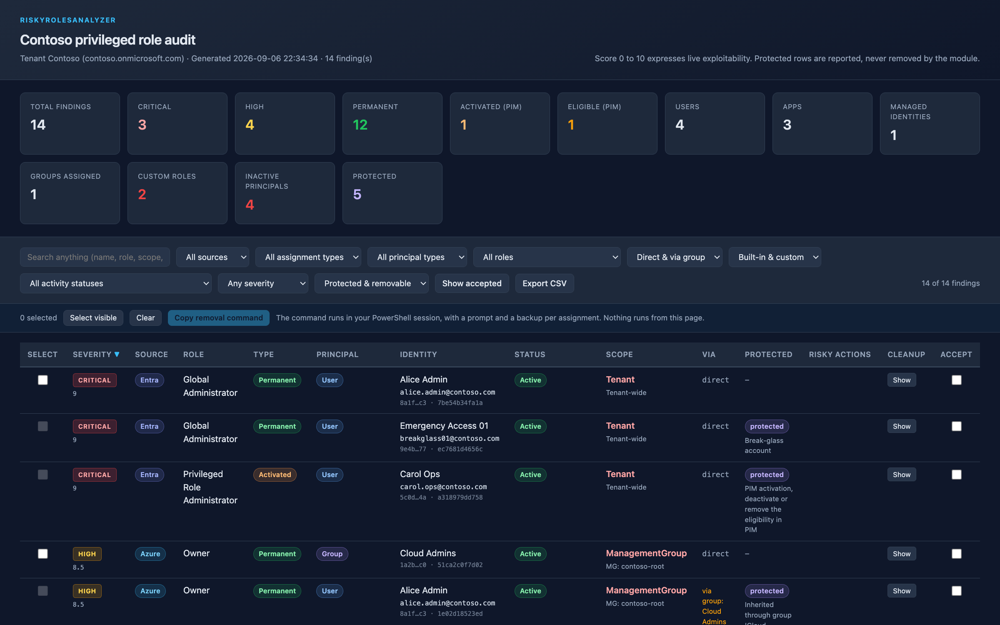

<p align="center"></p>

<p align="center">
  <a href="https://github.com/simon-vedder/risky-roles-analyzer/actions/workflows/ci.yml"></a>
  <a href="https://www.powershellgallery.com/packages/RiskyRolesAnalyzer"></a>
  
  
  
</p>

**Every privileged role assignment in your tenant, including the ones hiding behind groups, custom roles and dormant apps.**

Finds privileged Azure RBAC and Entra ID role assignments that posture tools miss, and lets you remove them safely.

## Why

Microsoft gives you the pieces: PIM with *Discovery and insights*, access reviews, the *Roles and
administrators* blade, `Get-AzRoleAssignment`. Each shows one slice. None of them answers the
question an audit starts with: **who holds privilege in this tenant right now, through what, and
how bad is it?**

The slices this module puts back together:

- **Custom roles that are privileged in effect.** A custom Azure or Entra role is rated by the
  actions it grants after `NotActions`, not by its name. `Microsoft.Authorization/*` is Owner in
  disguise; `microsoft.directory/users/password/update` is a password reset for everyone.
- **Privilege inherited through groups.** Nested groups are expanded and every member is listed
  with the group it inherits through, so "Cloud Admins is Owner" becomes twelve names.
- **Principals that should not be there any more.** Disabled users with permanent roles, app
  registrations whose every credential has expired, app registrations deactivated in the portal,
  service principals blocked by Microsoft. Classic persistence, quiet by design.
- **Azure and Entra in one list**, across every subscription, with management group and root
  assignments reported once instead of once per subscription.
- **Permanent versus PIM eligible**, scored separately, so a tenant that uses PIM properly looks
  different from one that does not.

The community has scripts and CSV exports for parts of this, and BloodHound for attack paths.
There is no PowerShell Gallery module that owns the inventory and the cleanup. This is for the
administrator or consultant who has to produce that list on Monday and clean it up on Tuesday.

## Features

- **Read-only by default.** `Get-RiskyRoleAssignment` needs read scopes only and returns objects,
  not a log: score, severity, why, the native cleanup command, and a stable `Id` per finding.
- **Rules you can read.** Every decision is a pure function with a test on a fixture. The role
  lists, risky actions and scoring weights live in one data file,
  [`RiskyRoleCatalog.psd1`](src/RiskyRolesAnalyzer/RiskyRoleCatalog.psd1).
- **Remove with a safety net.** `Remove-RiskyRoleAssignment` prompts per assignment, writes a JSON
  backup before it acts, and refuses anything marked protected: inherited through a group, PIM
  eligible or activated, your break-glass accounts, and the identity running the audit.
  `Restore-RiskyRoleAssignment` puts a backup file back.
- **Honest about limits.** [When not to use this](docs/when-not-to-use-this.md) and
  [KNOWN-ISSUES.md](KNOWN-ISSUES.md) list every sharp edge found.

## Quick start

```powershell
Install-Module RiskyRolesAnalyzer -AllowPrerelease

# 1. Sign in with the read scopes. Nothing changes.
Connect-RiskyRolesAnalyzer

# 2. Look. Objects for the pipeline, one HTML file for everyone else.
$findings = Get-RiskyRoleAssignment -BreakGlassAccount 'breakglass@contoso.com'
$findings | Format-Table
$findings | Export-RiskyRoleReport -Open

# 3. Pick and remove, with a prompt per assignment and a backup file. -WhatIf shows the plan.
$findings | Where-Object ActivityStatus -ne 'Active' | Remove-RiskyRoleAssignment -WhatIf
$findings | Show-RiskyRoleAssignment | Remove-RiskyRoleAssignment

# 4. Changed your mind? The backup file goes back in the same way.
Restore-RiskyRoleAssignment -Path ./RiskyRolesAnalyzer-backup-20260906-142200.json -WhatIf
```

`Show-RiskyRoleAssignment` uses `Out-ConsoleGridView` (install `Microsoft.PowerShell.ConsoleGuiTools`)
or `Out-GridView` on Windows. Entra-only tenants use `-SkipAzure`; tenants without Entra ID P2 use `-SkipPim`.

## The report

<p align="center"></p>

One file, no external resources. Summary cards, search, filters, sortable columns, CSV export, the
native cleanup command per finding, and a checkbox per removable finding that builds the
`Remove-RiskyRoleAssignment` line for your PowerShell session. Nothing runs from the page; it helps
you decide and hands you the command.

## What counts as privileged

Built-in roles from the catalog (Owner, User Access Administrator, Global Administrator,
Privileged Role Administrator and the rest of the usual list, plus the roles BloodHound treats as
dangerous), custom roles that grant a risky action, and anything you add with
`-AdditionalAzureRole` and `-AdditionalEntraRole`.

Each finding is scored from 0 to 10: a base per role, multiplied by scope breadth, lowered for
PIM eligibility and for principals that cannot sign in, raised a little for applications and
managed identities. Critical is 9 and above, High 7, Medium 5, Low 3. The score expresses live
exploitability; a disabled Global Administrator scores lower than an enabled one even though both
should go, which is why `ActivityStatus` is its own column.

## Safety

The tool proposes, you decide. `Remove-RiskyRoleAssignment` accepts only objects that
`Get-RiskyRoleAssignment` produced, asks before every assignment (`ConfirmImpact = 'High'`),
writes every assignment to a JSON file before the call, and reports protected assignments instead
of touching them. `-WhatIf` works everywhere. Azure assignments are removed by principal, role
definition id and scope; Entra assignments by their assignment id. Nothing is removed on behalf
of a group's members: the fix there is the group's own assignment or the membership, and both
are yours to decide.

## Permissions

Read path, all that `Connect-RiskyRolesAnalyzer` requests by default:

```
Graph:  RoleManagement.Read.Directory, Directory.Read.All, Group.Read.All, Application.Read.All
Azure:  Reader on every subscription in scope (a management group assignment works)
```

The write path adds `RoleManagement.ReadWrite.Directory` for Entra assignments (requested only
with `Connect-RiskyRolesAnalyzer -RequestWriteScopes`) and `Microsoft.Authorization/roleAssignments/delete`
on the Azure scope, which Owner and User Access Administrator have.

## Status

Pre-release `0.1.0-preview`. What is verified is in [docs/verification.md](docs/verification.md);
what is not is in [KNOWN-ISSUES.md](KNOWN-ISSUES.md). The read path has run on one real tenant;
the write path has not.

## Documentation

- Tool page: [simonvedder.com/tools/risky-roles-analyzer](https://simonvedder.com/tools/risky-roles-analyzer)
- [Verification log](docs/verification.md), [known issues](KNOWN-ISSUES.md), [when not to use this](docs/when-not-to-use-this.md)
- [Architecture decisions](docs/decisions), [releasing](docs/release.md), [contributing](CONTRIBUTING.md), [security](SECURITY.md), [changelog](CHANGELOG.md)

## License

MIT.
