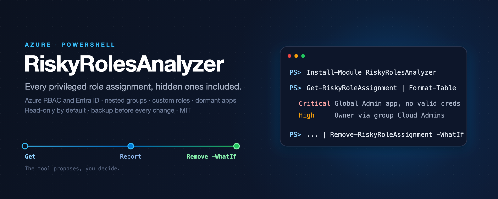

<p align="center"></p>

<p align="center">
  <a href="https://github.com/simon-vedder/risky-roles-analyzer/actions/workflows/ci.yml"></a>
  <a href="https://www.powershellgallery.com/packages/RiskyRolesAnalyzer"></a>
  
  
  
</p>

**Every privileged role assignment in your tenant, including the ones hiding behind groups, custom roles and dormant apps.**

Finds privileged Azure RBAC and Entra ID role assignments that posture tools miss, and lets you remove them safely.

## Why

- What Microsoft ships for this, and where it stops.
- What the community has, and what it does not cover.
- The population this is for.

## Features

- **Read-only by default.** `Get-RiskyRoleAssignment` needs read scopes only and returns objects, not a log.
- **Rules you can read.** Every decision is a pure function with a test on a fixture.
- **Remove with a safety net.** `Remove-RiskyRoleAssignment` prompts per object, writes a JSON backup before
  it acts, and refuses anything marked protected.
- **Honest about limits.** [When not to use this](docs/when-not-to-use-this.md) and
  [KNOWN-ISSUES.md](KNOWN-ISSUES.md) list every sharp edge found.

## Quick start

```powershell
Install-Module RiskyRolesAnalyzer -AllowPrerelease

# 1. Look. Nothing changes.
Get-RiskyRoleAssignment | Format-Table Name, Severity, Reason

# 2. Pick and remove, with a prompt per object and a backup file. -WhatIf shows the plan.
Get-RiskyRoleAssignment -MinimumSeverity High | Remove-RiskyRoleAssignment -WhatIf
Get-RiskyRoleAssignment | Out-ConsoleGridView -PassThru | Remove-RiskyRoleAssignment
```

## Safety

The tool proposes, you decide. `Remove-RiskyRoleAssignment` accepts only objects that `Get-RiskyRoleAssignment` produced,
asks before every object (`ConfirmImpact = 'High'`), writes every object to a JSON file before the
call, and reports protected objects instead of touching them. `-WhatIf` works everywhere.


## Permissions

```
<exact Graph scopes or RBAC actions for the read path>
```

The write path adds `<...>` and is only requested with the switch that enables it.

## Status

Pre-release `0.1.0-preview`. What is verified is in [docs/verification.md](docs/verification.md);
what is not is in [KNOWN-ISSUES.md](KNOWN-ISSUES.md).

## Documentation

- Tool page: [simonvedder.com/tools/risky-roles-analyzer](https://simonvedder.com/tools/risky-roles-analyzer)
- [Verification log](docs/verification.md), [known issues](KNOWN-ISSUES.md), [when not to use this](docs/when-not-to-use-this.md)
- [Architecture decisions](docs/decisions), [releasing](docs/release.md), [contributing](CONTRIBUTING.md), [security](SECURITY.md), [changelog](CHANGELOG.md)

## License

MIT.
